<div align='center'>
  
  
  <p align="center">
  <a href="#features-of-config"></a>
  <a href="#nix"></a>
  <a href="#screenshots">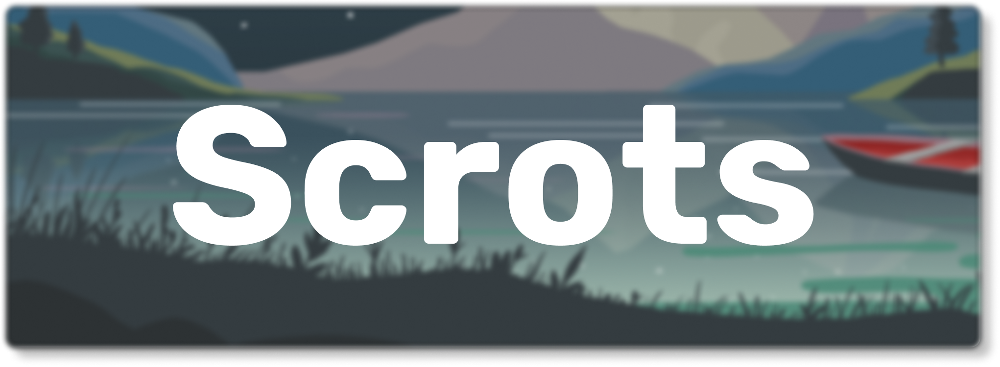</a>
  <a href="#installation"></a>
  <a href="#credits"></a>
  </p><br>
</div>

Welcome to my nix dotfiles! This branch contains all my nix files that I have in my `/etc/nixos` folder! For my awesomewm config checkout [this branch](https://github.com/chadcat7/fuyu/tree/the-awesome-config)! <br>


> **Warning**
>
> I am still very very new to nix and sometimes can also commit broken code! At best only use them as a reference for something you cannot find elsewhere!


## Features of config
+ **OS**     -  nixos
+ **WM**     -  awesome
+ **Shell**  -  zsh
+ **Term**   -  st
+ **Music**  -  ncmpcpp
+ **Comp**   -  picom
+ **Editor** -  nvim


#### Features Of the Awesome Config
+ Desktop Icons completely implemented in awesome
+ And a dock completely in awesome too
+ Cool Titlebars
+ Modern Top Panel
+ Two Section Dashboard
+ Control Panel with Theme Switcher
+ Wallpaper Switcher
+ Better right click menu with icons
+ Calendar and Weather Widget
+ i3lock-color like lockscreen with profile picture
+ Minimal no-nonsense exit screen
+ Application Launcher
+ Good Looking notifications
+ Mouse friendly custom ncmpcpp ui
+ Video Recorder and Screenshotter


## Nix

The "Textbook" Definition - A Linux distribution based on the Nix package manager and guided by Nix's core principles.

NixOS is a unique distro. Unlike other distros where you store your configurations in `~/.config/` and binaries in `~/.local/bin` , nix takes a different approach. Instead you can [declaratively](https://zero-to-nix.com/concepts/declarative) define your configuration in `.nix` files. These nix files can be used to install and configure programs, services, setting up things like xresources, etc. This approach provides a modular system that enables users to share, reuse, and modify their configurations easily. <br> <br>

**Sounds Confusing right?** Dont worry here let me simplify some things for you.
```
derivs/
    phocus.nix
    ...
home/
    namish/
        home.nix
        ...
    shared/
        ...
hosts/
    nixl/
        hardware-configuration.nix
        configuration.nix
    shared/
        default.nix
overlays/
      default.nix
patches/
pkgs/
flake.nix
nixpkgs.nix
shell.nix
```
This is the general structure of my dotfiles. I am using a beta feature called `flakes` and thats the reason why you will sea a file called `flake.nix`. Let us start with that!

1. flake.nix
  + This main file, it consists of two main parts, `inputs` and `outputs`. Inputs are Nix dependencies that a flake needs to be built. Each input in the set can be pulled from various sources, such as github, generic git repositories, and even from your local filesystem. All of these inputs are saved in the `flake.lock` file. Flake outputs are what a flake produces as part of its build. In this case it produces a NixOS configuration.

2. hosts/ folder
  + This folder contains configurations for our machines
  + The `nixl` folder is the main one where my configuration is stored, the `shared` one contains configurations that would be same for all machines that I am _gonna_ own.

3. home/ folder
  + this folder contains the home-manager configuration for different users. Like before `shared` contains configurations that would be same for all users.
  + `shared` contains things like bin files, colors, gtkThemes

4. derivations
  + "techincal" definition - 'A derivation is an instruction that Nix uses to realise a Nix package'
  + In simple words, deriavations are used to install stuff that aren't available in the nixpkg repositories. (atleast that is what i use them for). Make your own derivation in `derivs/program.nix` and call it in `overlays/default.nix`

5. overlays
  + they are just modifications you do on top of the original program, for example patching st, or using a fork of st from github.

> **Warning** 
>
> by no means are the above things I say 100% the truth. I maybe wrong somewhere, if you spot a mistake kindly prompt me to correct it


### WOW! NixOS looks so god damn cool! I am just gonna jump right into it
**NO**. NixOS is hard.Don't be impatient and jump with the hype train. Nix files are complicated to make and can cause high brain damage. I recommend you to start with the [nix package manager](https://nixos.org/download.html#nix-install-linux) or using NixOS in a virtual machine instead of ripping apart your hard disk.

#### I really wanna try out NixOS!
If you that determined, here are some resources to start out
  + [zero-to-nix](https://zero-to-nix.com)
  + [pills](https://nixos.org/guides/nix-pills/)
  + [nix-starter-config](https://github.com/Misterio77/nix-starter-config)

## Screenshots
| <b>Cool Dashboard with 2 sections</b>                                                                              |
| ------------------------------------------------------------------------------------------------------------------ |
| <a href="#--------">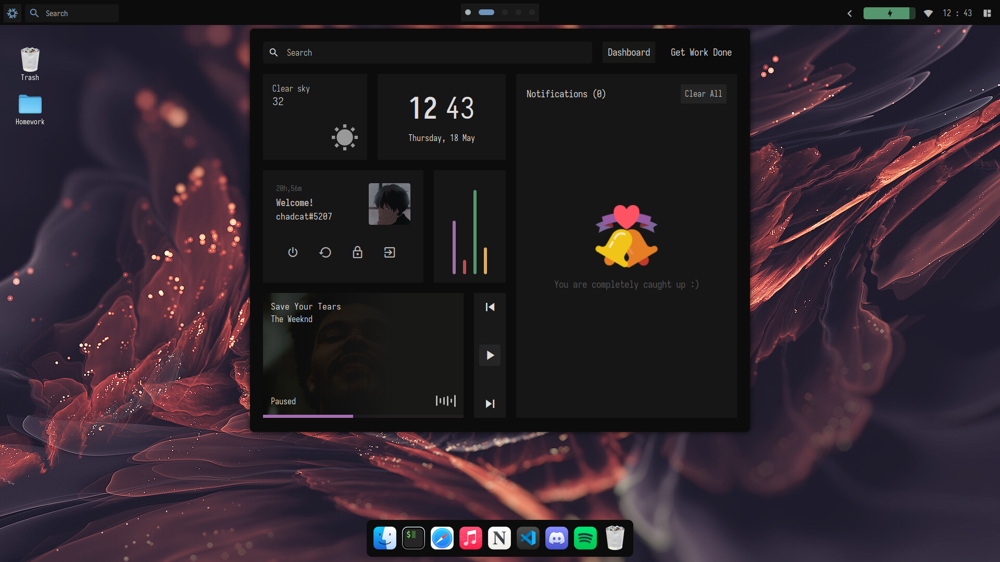</a>                    |
| <a href="#--------">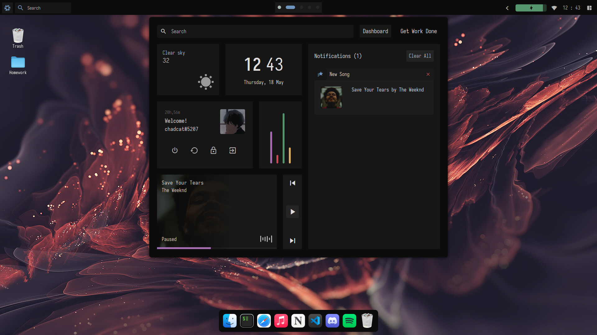</a>                    |
| <a href="#--------">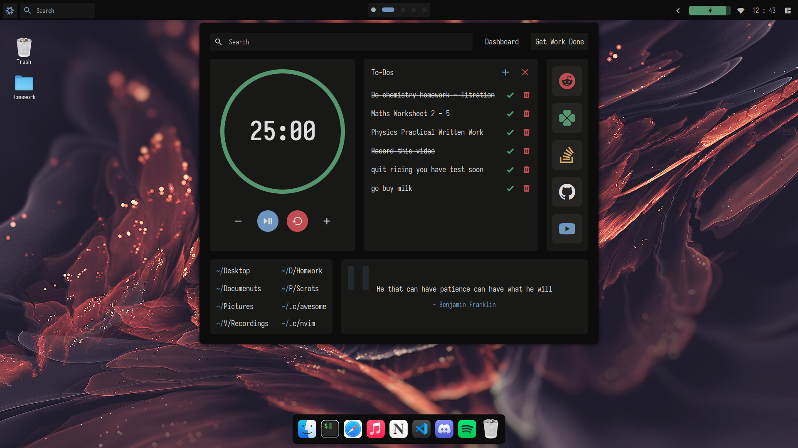</a>                    |

| <b>Control Panel</b>                                                                                               |
| ------------------------------------------------------------------------------------------------------------------ |
| <a href="#--------">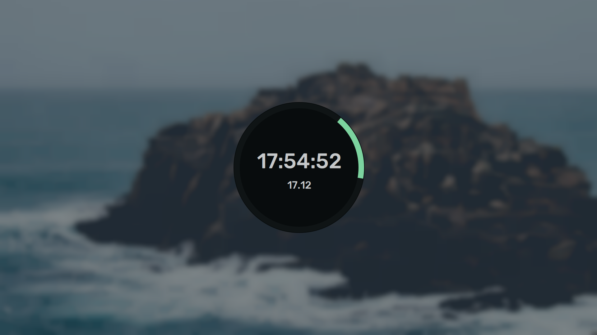</a>                    |

| <b>Exitscreen and Lockscreen</b>                                                                                   |
| ------------------------------------------------------------------------------------------------------------------ |
| <a href="#--------">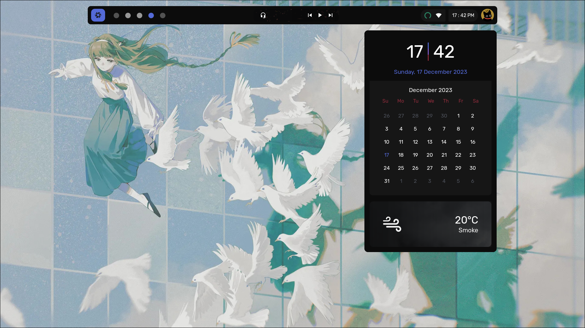</a>                    |
| <a href="#--------">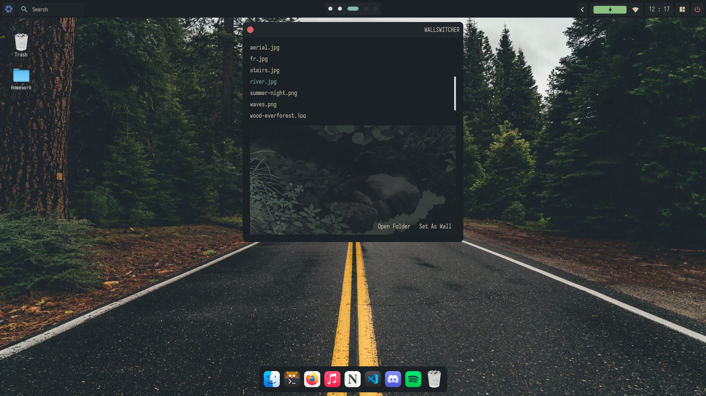</a>                    |

| <b>Screenshotter and Video Recorder</b>                                                                            |
| ------------------------------------------------------------------------------------------------------------------ |
| <a href="#--------">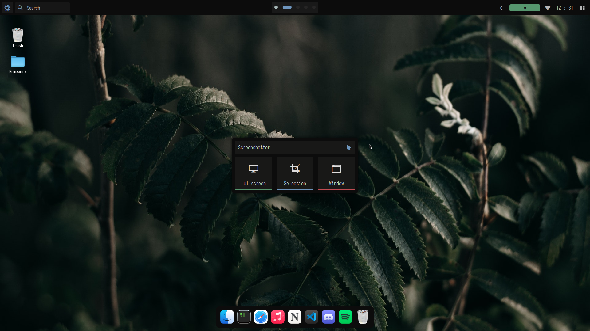</a>                    |
| <a href="#--------">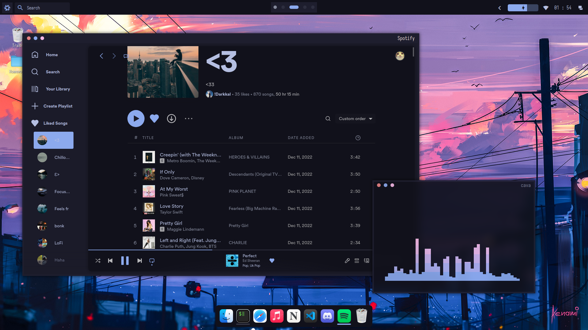</a>                    |


| <b>Calendar + Weather Widget</b>                                                                                   |
| ------------------------------------------------------------------------------------------------------------------ |
| <a href="#--------">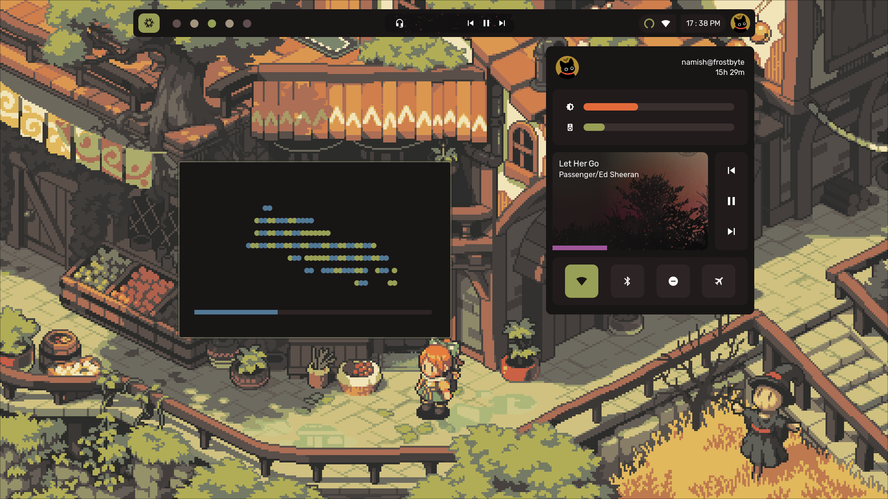</a>                    |


| <b>Right Click Menu</b>                                                                                            |
| ------------------------------------------------------------------------------------------------------------------ |
| <a href="#--------">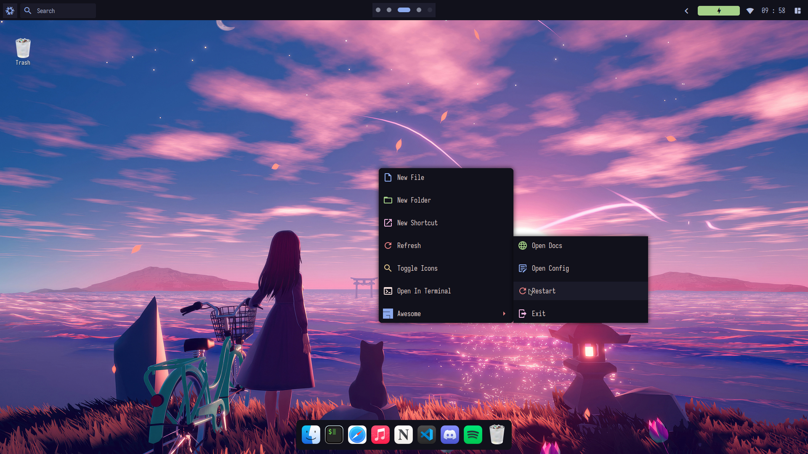</a>                    |

| <b>App Menu</b>                                                                                                    |
| ------------------------------------------------------------------------------------------------------------------ |
| <a href="#--------">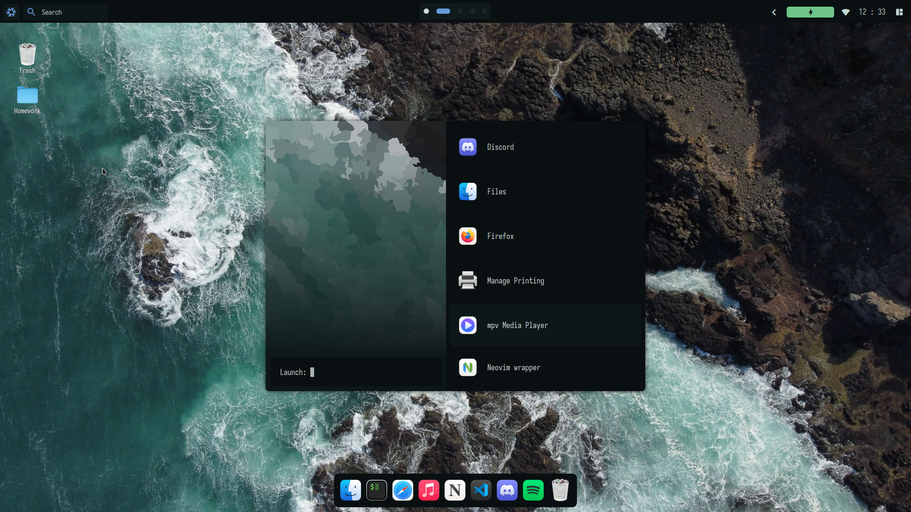</a>                    |

| <b>Custom Ncmpcppp UI</b>                                                                                          |
| ------------------------------------------------------------------------------------------------------------------ |
| <a href="#--------">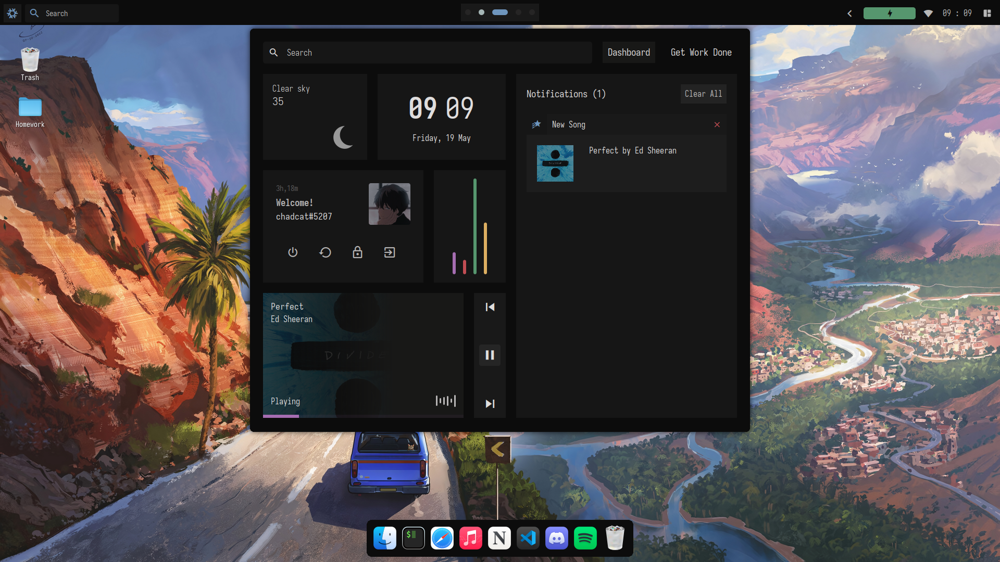</a>                    |
| <a href="#--------">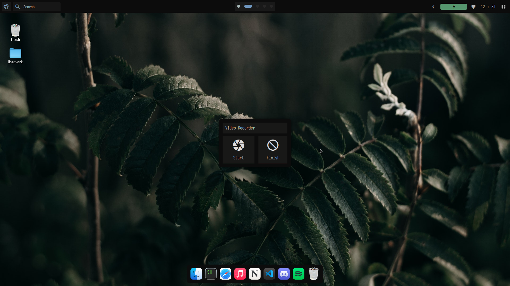</a>                    |


| <b>Wallpaper Switcher</b>                                                                                          |
| ------------------------------------------------------------------------------------------------------------------ |
| <a href="#--------">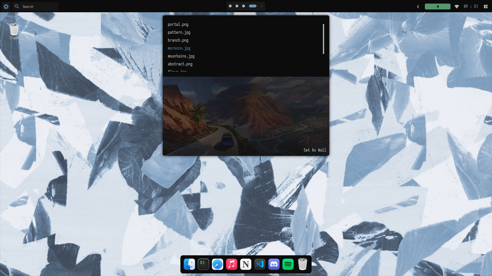</a>                    |

| <b>Spicetify</b>                                                                                          |
| ------------------------------------------------------------------------------------------------------------------ |
| <a href="#--------">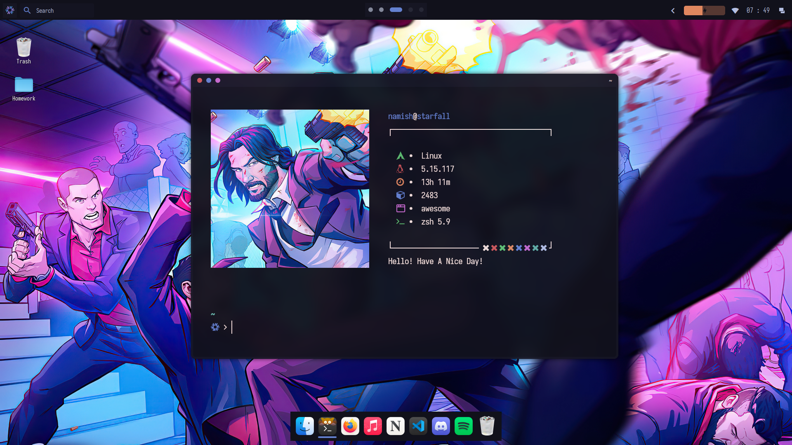</a>                    |

## Installation
> **Warning**
>
> These instructions were made for future me incase I ever get a new laptop / pc. My awesome config will 9/10 times contain a lot of broken code that can ruin your awesome experience. Please only use these files as a reference and nothing else. DONT FUCKING COPY THEM!!

Make your own dotfiles, installing them is a bad idea as they are made specifically for my machine and there is 1/6th chance that this will make you end up in North Korea's assassination list. <br>
You have been warned! <br>

1. Get the latest [NixOS ISO](https://nixos.org/download.html) and boot into the installer/environment.
2. Format and mount your disks.
3. Follow these commands (you might need root privileges):

```bash
$ nix-shell -p git nixUnstable ## install git and unstable nix
```

```bash
$ git clone --depth 1 https://github.com/chadcat7/fuyu /mnt/etc/nixos --recurse-submodules ## cloning my config
```

```bash
$ rm /mnt/etc/nixos/hosts/<your host>/hardware-configuration.nix ## remove the hardware-configuration.nix for my system!
```

```bash
$ nixos-generate-config --root /mnt ## generate yours
$ cp /mnt/etc/nixos/hardware-configuration.nix /mnt/etc/nixos/hosts/<your host>/
$ rm /mnt/etc/nixos/configuration.nix
```

```bash
$ cd /mnt/etc/nixos
$ nixos-install --flake '.#nixl'
```

Congrats! You just installed NixOS! Now lets install the environment and the configs

4. Reboot, login as root, and change the password for your user using `passwd`.
5. Log in as your normal user.
6. Follow these commands:

```bash
sudo chown -R $USER /etc/nixos # change ownership of configuration folder
cd /etc/nixos
home-manager switch --flake '.#namish' # this should automatically install nvim and awesome config
```

<pre align="center">
<a href="#japan--history">

</a>
</pre>

## Todo
somethings i need to do before i can call it fully usable - <br>
- [x] Install phocus with dynamic theming 
- [x] Install any image colorizer
- [x] Lock screen setup (now with awesome)
- [x] Add Screenshots
- [x] Spicetify

## Credits
These are the chads which helped me throughout my short but crazy nix journey!
- [gw](https://github.com/Gwynsav)
- [javacafe](https://github.com/JavaCafe01/)
- [f2k](https://github.com/fortuneteller2k/)
- [apro](https://github.com/Aproxia-dev)
- [viper](https://github.com/viperML/)

And of course credits for the guys for their help with my awesome config!
- [stardust](https://github.com/stardust-kyun/)
- [gw](https://github.com/Gwynsav)
- [kasper](https://github.com/Kasper24)
- [manas](https://github.com/Manas140)
- [ilovecookie](https://github.com/manilarome)
- [crylia](https://github.com/crylia/)
- [rxyhn](https://github.com/rxyhn)


**Feel free to use any code from the two branches as long as you will credit me**
