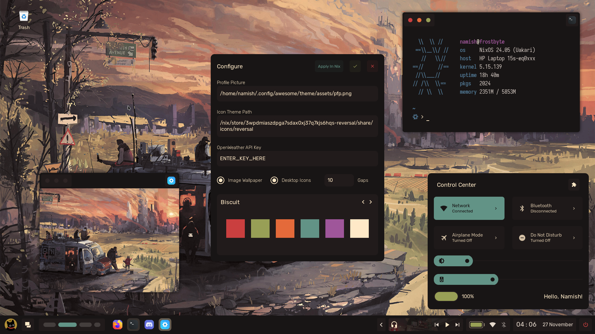
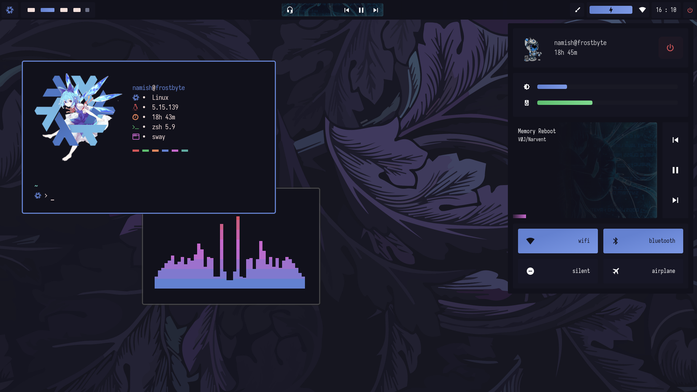
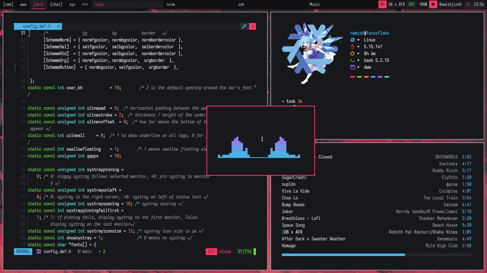
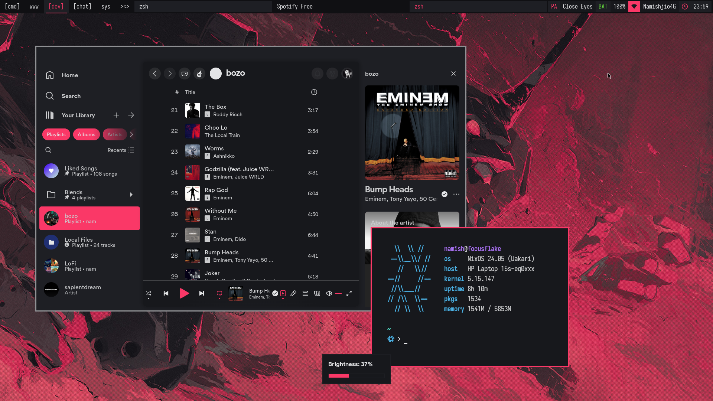
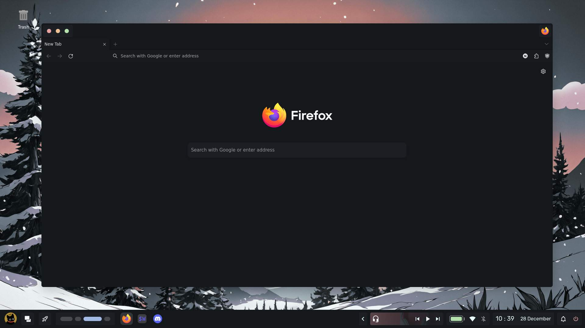
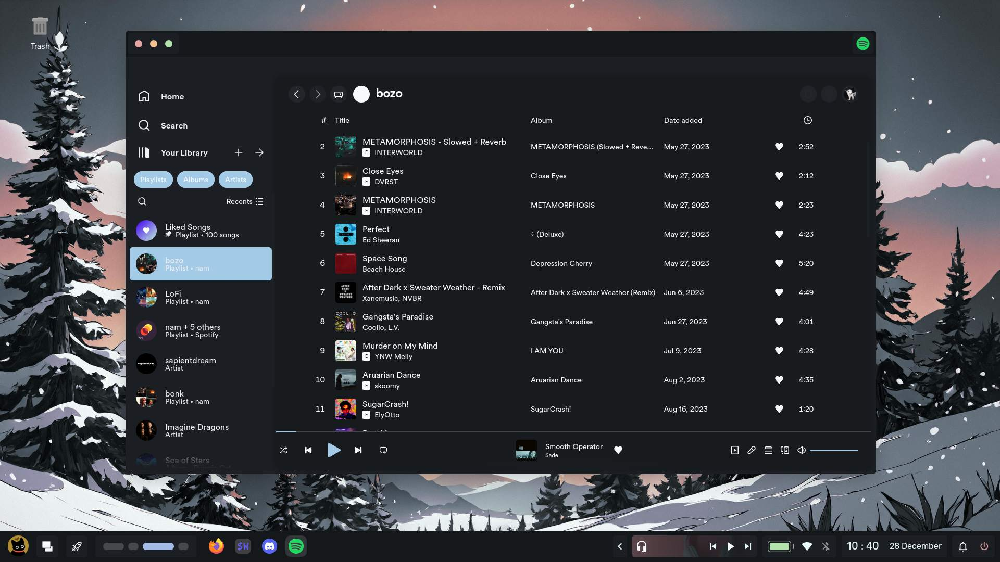
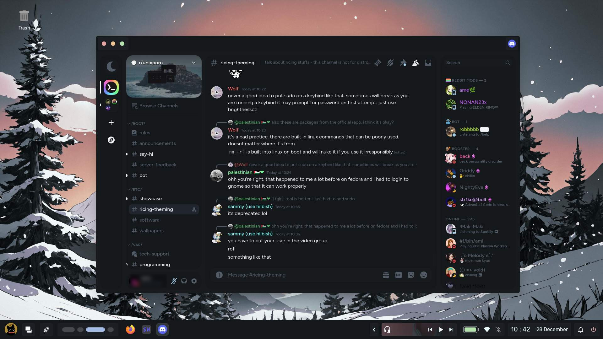
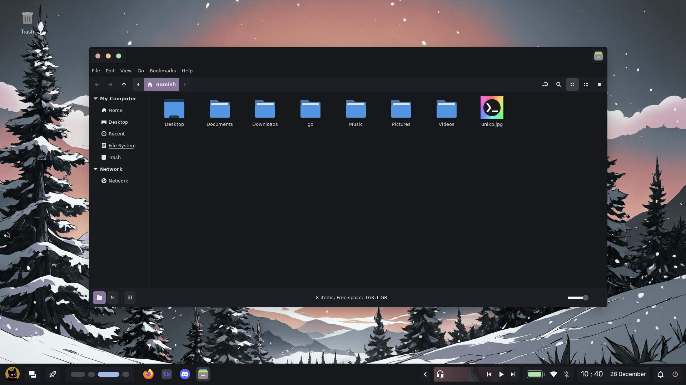
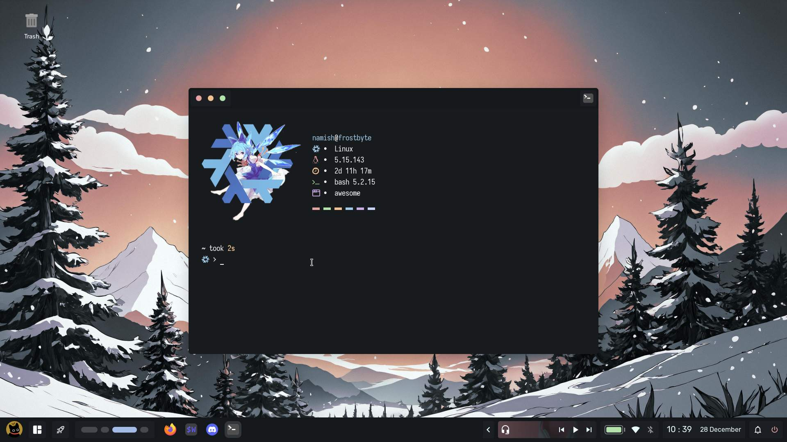

<div align="center">


<br>
<br>


</div>


> [!Important]
>
> New Changes Soon.

## Features of config
+ **OS**     -  nixos // arch
+ **WM**     -  awesome - [blizzard](https://github.com/chadcat7/crystal/tree/blizzard) // [aura](https://github.com/chadcat7/fuyu/tree/aura) // hyprland
+ **Shell**  -  zsh
+ **Term**   -  wezterm
+ **Music**  -  ncmpcpp
+ **Comp**   -  picom - [fdev31 fork](https://github.com/fdev31/picom/tree/animation-pr)
+ **Editor** -  nvim v0.9 - [my config](https://github.com/chadcat7/lodo)

## Nix 

> [!note]
>
> I have written a [blog post](https://nam.is-a.dev/blog/nixos) on setting up Nixos. And for those who are interested in learning about ricing itself, I have a seperate blog post about is. Checkout the [Ricing Guide](https://nam.is-a.dev/blog/ricing/) (btw it also got featured in the official unixporn wiki).


The "Textbook" Definition - A Linux distribution based on the Nix package manager and guided by Nix's core principles.

NixOS is a unique distro. Unlike other distros where you store your configurations in `~/.config/` and binaries in `~/.local/bin` , nix takes a different approach. Instead you can [declaratively](https://zero-to-nix.com/concepts/declarative) define your configuration in `.nix` files. These nix files can be used to install and configure programs, services, setting up things like xresources, etc. This approach provides a modular system that enables users to share, reuse, and modify their configurations easily. <br> <br>

**Sounds Confusing right?** Dont worry here let me simplify some things for you.
```
derivs/
    phocus.nix
    ...
home/
    namish/
        home.nix
        ...
    shared/
        ...
hosts/
    frostbyte/
        hardware-configuration.nix
        configuration.nix
    shared/
        default.nix
overlays/
      default.nix
patches/
pkgs/
flake.nix
nixpkgs.nix
shell.nix
```
This is the general structure of my dotfiles. I am using a beta feature called `flakes` and thats the reason why you will sea a file called `flake.nix`. Let us start with that!

1. flake.nix
  + This main file, it consists of two main parts, `inputs` and `outputs`. Inputs are Nix dependencies that a flake needs to be built. Each input in the set can be pulled from various sources, such as github, generic git repositories, and even from your local filesystem. All of these inputs are saved in the `flake.lock` file. Flake outputs are what a flake produces as part of its build. In this case it produces a NixOS configuration.

2. hosts/ folder
  + This folder contains configurations for our machines
  + The `frostbyte` folder is the main one where my configuration is stored, the `shared` one contains configurations that would be same for all machines that I am _gonna_ own.

3. home/ folder
  + this folder contains the home-manager configuration for different users. Like before `shared` contains configurations that would be same for all users.
  + `shared` contains things like bin files, colors, gtkThemes

4. derivations
  + "techincal" definition - 'A derivation is an instruction that Nix uses to realise a Nix package'
  + In simple words, deriavations are used to install stuff that aren't available in the nixpkg repositories. (atleast that is what i use them for). Make your own derivation in `derivs/program.nix` and call it in `overlays/default.nix`

5. overlays
  + they are just modifications you do on top of the original program, for example patching st, or using a fork of st from github.

> [!Warning]
>
> by no means are the above things I say 100% the truth. I maybe wrong somewhere, if you spot a mistake kindly prompt me to correct it

### WOW! NixOS looks so god damn cool! I am just gonna jump right into it
**NO**. NixOS is hard.Don't be impatient and jump with the hype train. Nix files are complicated to make and can cause high brain damage. I recommend you to start with the [nix package manager](https://nixos.org/download.html#nix-install-linux) or using NixOS in a virtual machine instead of ripping apart your hard disk.

#### I really wanna try out NixOS!
If you that determined, here are some resources to start out
  + [zero-to-nix](https://zero-to-nix.com)
  + [pills](https://nixos.org/guides/nix-pills/)
  + [nix-starter-config](https://github.com/Misterio77/nix-starter-config)


## Rices

| <b>Aura</b>                                                                                      |
| ------------------------------------------------------------------------------------------------------------------ |
| <a href="https://github.com/chadcat7/crystal/tree/aura"></a>                    |

| <b>Freosan</b>                                                                                     |
| ------------------------------------------------------------------------------------------------------------------ |
| <a href="https://github.com/chadcat7/crystal/tree/freosan"></a>                    |

| <b>Blizzard (Do not use)</b>                                                                                     |
| ------------------------------------------------------------------------------------------------------------------ |
| <a href="https://github.com/chadcat7/crystal/tree/blizzard"></a>                    |

| <b>Glacier</b>                                                                                      |
| ------------------------------------------------------------------------------------------------------------------ |
| <a href="https://github.com/chadcat7/crystal/tree/glacier"></a>                    |

| <b>Kawai</b>                                                                                      |
| ------------------------------------------------------------------------------------------------------------------ |
| <a href="https://github.com/chadcat7/crystal/tree/kawai"></a>                    |

| <b>Vercel</b>                                                                                      |
| ------------------------------------------------------------------------------------------------------------------ |
| <a href="https://github.com/chadcat7/crystal/tree/vercel"></a>                    |

> [!NOTE]
>
> For screenshots, go to each rice's respective branch. Also I am aware of the fact that none of the rices are themed like they are named. They are all named like that because the words are related to winter / snow which means nix.
> To get Basic dotfiles, go to the [simplefiles branch](https://github.com/chadcat7/crystal/tree/simplefiles).

### Focus Flake. 
This is a very minimal dwm rice I made to quit ricing. This build mainly contains useful patches like xrdb, swallow, awesomebar,scratchpads, etc. The way of patching is so shit with nixos because I had to manually modify each patch to not conflict with the other. 

| <b>focusflake</b>                                                                                      |
| ------------------------------------------------------------------------------------------------------------------ |
| <a href="#"></a>                    |
| <a href="#"></a>                    |


## Theming

| <b>Firefox</b>                                                                                      |
| ------------------------------------------------------------------------------------------------------------------ |
|          |

| <b>Spicetify</b>                                                                                     |
| ------------------------------------------------------------------------------------------------------------------ |
|                   |

| <b>Vencord</b>                                                                                      |
| ------------------------------------------------------------------------------------------------------------------ |
|                   |

| <b>Phocus</b>                                                                                      |
| ------------------------------------------------------------------------------------------------------------------ |
|                   |

| <b>Neofetch</b>                                                                                      |
| ------------------------------------------------------------------------------------------------------------------ |
|                   |

## Credits
These are the chads which helped me throughout my short but crazy nix journey!
- [gw](https://github.com/Gwynsav)
- [javacafe](https://github.com/JavaCafe01/)
- [f2k](https://github.com/fortuneteller2k/)
- [apro](https://github.com/Aproxia-dev)
- [viper](https://github.com/viperML/)

And of course credits for the guys for their help with my awesome config!
- [stardust](https://github.com/stardust-kyun/)
- [gw](https://github.com/Gwynsav)
- [kasper](https://github.com/Kasper24)
- [manas](https://github.com/Manas140)
- [ilovecookie](https://github.com/manilarome)
- [crylia](https://github.com/crylia/)
- [rxyhn](https://github.com/rxyhn)

People from who I have ~~stolen~~ taken inspiration for my design.

- [tsukki](https://github.com/tsukki9696)
- [sammy](https://github.com/TorchedSammy)
- [kizu](https://github.com/janleigh)
- [gw](https://github.com/Gwynsav)

**Feel free to use any code from any branch as long as you will credit me**
